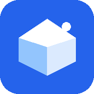

<p align="center">
  
</p>

<h1 align="center">CollectR</h1>

<p align="center">
  <strong>Die intelligente Sammlungsverwaltung fuer leidenschaftliche Sammler</strong>
</p>

<p align="center">
  <a href="#-features">Features</a> •
  <a href="#-demo">Demo</a> •
  <a href="#-installation">Installation</a> •
  <a href="#-tech-stack">Tech Stack</a> •
  <a href="#-api-integrationen">APIs</a> •
  <a href="#-roadmap">Roadmap</a>
</p>

<p align="center">
  
  
  
  
  
</p>

---

## Was ist CollectR?

CollectR ist eine moderne, datenschutzfreundliche Web-App zur Verwaltung deiner Sammlungen. Egal ob Schallplatten, Muenzen, Hot Wheels, Buecher oder Antiquitaeten – CollectR hilft dir, den Ueberblick zu behalten, Werte zu tracken und deine Sammlung zu organisieren.

---

## Highlights

```
+------------------------------------------------------------------+
|                                                                  |
|    Unbegrenzte          11 Fertige           Barcode-            |
|    Sammlungen           Vorlagen             Scanner             |
|        oo                  oo                  oo                |
|                                                                  |
|    Dashboard            Sammlungs-           Import/             |
|    & Charts             Ziele                Export              |
|        oo                  oo                  oo                |
|                                                                  |
|    Discogs              Open Library         Dark Mode           |
|    Integration          fuer Buecher         Support             |
|        oo                  oo                  oo                |
|                                                                  |
+------------------------------------------------------------------+
```

---

## Features

### Sammlungsverwaltung

| Feature | Beschreibung |
|---------|-------------|
| **Unbegrenzte Sammlungen** | Erstelle beliebig viele Sammlungen fuer verschiedene Kategorien |
| **11 Vorlagen** | Hot Wheels, Muenzen, Briefmarken, Vinyl, LEGO, Moebel, Schmuck, Comics, Uhren, Spielzeug, Antiquitaeten |
| **Kategorien & Tags** | Hierarchische Kategorien mit Icons und Farben |
| **Flexible Attribute** | 8 Attributtypen: Text, Nummer, Auswahl, Tags, Checkbox, Datum, Link, Waehrung |

### Item-Management

- **Vollstaendige CRUD-Operationen** – Erstellen, Bearbeiten, Loeschen
- **Rich Metadata** – Kaufpreis, Datum, Ort, Waehrung
- **Status-Tracking** – In Sammlung, Verkauft, Wunschliste, Bestellt, Verloren
- **Barcode-Support** – Scanner-Integration fuer schnelles Hinzufuegen
- **Mehrere Bilder** – Galerie-Ansicht mit Primaerbild

### Dashboard & Analytics

```
+-------------------------------------------------------------+
|  Dashboard                                                  |
+-------------+-------------+-------------+-------------------+
| 3           | 127         | EUR 4,250   | 12                |
| Sammlungen  | Items       | Gesamtwert  | Kategorien        |
+-------------+-------------+-------------+-------------------+
|                                                             |
|  [Kategorien-Chart]          [Status-Chart]                 |
|                                                             |
|  [Wertvollste Items]         [Letzte Aktivitaet]            |
|   1. Rolex Submariner         - Item hinzugefuegt           |
|   2. Vintage LP               - Sammlung erstellt           |
|   3. Goldmuenze               - Preis aktualisiert          |
+-------------------------------------------------------------+
```

### Sammlungsziele

Setze dir Ziele und verfolge deinen Fortschritt:

- **Anzahl-Ziele** – "100 Schallplatten sammeln"
- **Wert-Ziele** – "Sammlung auf EUR 10.000 bringen"
- **Kategorie-Ziele** – "50 Jazz-Platten sammeln"
- **Deadlines** – Mit Fortschrittsanzeige und Warnungen

### Barcode-Scanner

```
+-----------------------------+
|                             |
|   +-------------------+     |
|   |                   |     |
|   |   [ Kamera ]      |     |
|   |                   |     |
|   +-------------------+     |
|                             |
|   Erkannte Formate:         |
|   EAN-13 - EAN-8 - UPC-A    |
|   UPC-E - Code-128 - QR     |
+-----------------------------+
```

### Import & Export

| Format | Import | Export |
|--------|:------:|:------:|
| CSV    |   Ja   |   Ja   |
| JSON   |   Ja   |   Ja   |

- Intelligente Spaltenerkennung
- Automatisches Kategorie-Mapping
- Selektiver Export nach Status

### Tools

| Tool | Beschreibung |
|------|-------------|
| **Waehrungsrechner** | Live-Kurse fuer 8 Waehrungen (EUR, USD, GBP, CHF, JPY, CNY, AUD, CAD) |
| **Markt-Ticker** | Echtzeit-Preise fuer Gold, Silber, Bitcoin, Ethereum |
| **Sammler-News** | News-Feed fuer deine Sammelgebiete |
| **Buch-Suche** | Open Library Integration (ISBN, Titel, Autor) |
| **Vinyl-Suche** | Discogs Integration (Barcode, Kuenstler, Album) |

---

## Tech Stack

| Kategorie | Technologie |
|-----------|-------------|
| **Framework** | Next.js 15 (App Router) |
| **Sprache** | TypeScript (strict mode) |
| **Styling** | Tailwind CSS v4 |
| **Backend** | Supabase (PostgreSQL) |
| **Auth** | Supabase Auth + SSR |
| **PWA** | next-pwa v5.6 |
| **React** | v19 |
| **Hosting** | Vercel |

### Architektur

```
+-------------------------------------------------------------+
|                      Frontend                               |
|  +-----------+  +-----------+  +-----------+                |
|  |  Next.js  |  |   React   |  | Tailwind  |                |
|  | App Router|  |Components |  |    CSS    |                |
|  +-----+-----+  +-----+-----+  +-----------+                |
|        |              |                                     |
|        +------+-------+                                     |
|               |                                             |
|  +------------v------------------------------------------+  |
|  |              Supabase Client                          |  |
|  |         (Auth, Database, Storage)                     |  |
|  +---------------------------+---------------------------+  |
+------------------------------|------------------------------+
                               |
+------------------------------v------------------------------+
|                      Backend                                |
|  +-------------------------------------------------------+  |
|  |                 Supabase                              |  |
|  |  +----------+  +----------+  +----------+             |  |
|  |  |PostgreSQL|  |   Auth   |  | Storage  |             |  |
|  |  |    DB    |  |  (JWT)   |  | (Images) |             |  |
|  |  +----------+  +----------+  +----------+             |  |
|  +-------------------------------------------------------+  |
|                                                             |
|  +-------------------------------------------------------+  |
|  |              External APIs                            |  |
|  |  Discogs - Open Library - CoinGecko - GNews           |  |
|  +-------------------------------------------------------+  |
+-------------------------------------------------------------+
```

---

## Installation

### Voraussetzungen

- Node.js 18+
- npm oder yarn
- Supabase Account

### 1. Repository klonen

```bash
git clone https://github.com/westside0106/CollectR.git
cd CollectR
```

### 2. Abhaengigkeiten installieren

```bash
npm install
```

### 3. Umgebungsvariablen

Erstelle eine `.env.local` Datei:

```env
# Supabase (erforderlich)
NEXT_PUBLIC_SUPABASE_URL=https://your-project.supabase.co
NEXT_PUBLIC_SUPABASE_ANON_KEY=your-anon-key

# APIs (optional)
NEXT_PUBLIC_CURRENCYLAYER_API_KEY=your-key
NEXT_PUBLIC_GNEWS_API_KEY=your-key
DISCOGS_TOKEN=your-token
```

### 4. Datenbank einrichten

Fuehre die SQL-Migrationen in deinem Supabase Dashboard aus.

### 5. Entwicklungsserver starten

```bash
npm run dev
```

Oeffne [http://localhost:3000](http://localhost:3000)

---

## Projektstruktur

```
CollectR/
|-- src/
|   |-- app/                    # Next.js App Router
|   |   |-- page.tsx            # Dashboard
|   |   |-- collections/        # Sammlungen
|   |   |   |-- [id]/
|   |   |   |   |-- items/      # Items CRUD
|   |   |   |   |-- categories/ # Kategorien
|   |   |   |   |-- import/     # Import
|   |   |   |   |-- export/     # Export
|   |   |   |   |-- scan/       # Scanner
|   |   |   |-- new/            # Neue Sammlung
|   |   |-- tools/              # Werkzeuge
|   |   |   |-- currency/       # Waehrungsrechner
|   |   |   |-- market/         # Markt-Ticker
|   |   |   |-- news/           # News
|   |   |   |-- books/          # Buch-Suche
|   |   |   |-- vinyl/          # Vinyl-Suche
|   |   |-- api/                # API Routes
|   |       |-- discogs/        # Discogs Proxy
|   |
|   |-- components/             # React Komponenten
|   |   |-- layout/             # Layout (Sidebar)
|   |   |-- BarcodeScanner.tsx
|   |   |-- DashboardCharts.tsx
|   |   |-- CollectionGoals.tsx
|   |   |-- ImageUpload.tsx
|   |   |-- SearchBar.tsx
|   |   |-- FilterBar.tsx
|   |
|   |-- services/               # API Services
|   |   |-- currencyService.ts
|   |   |-- marketService.ts
|   |   |-- newsService.ts
|   |   |-- openLibraryApi.ts
|   |   |-- discogsApi.ts
|   |
|   |-- lib/supabase/           # Supabase Client
|   |-- contexts/               # React Context
|   |-- hooks/                  # Custom Hooks
|   |-- types/                  # TypeScript Types
|
|-- public/
|   |-- manifest.json           # PWA Manifest
|   |-- icons/                  # App Icons
|   |-- brand/                  # Branding Assets
|
|-- middleware.ts               # Auth Middleware
|-- next.config.ts              # Next.js Config
|-- package.json
```

---

## API-Integrationen

### Discogs API

Vinyl- und Musikdatenbank mit ueber 15 Millionen Releases.

```typescript
// Barcode-Suche
const results = await searchDiscogs({ barcode: '0602537479658' })

// Text-Suche
const results = await searchDiscogs({ query: 'Pink Floyd Dark Side' })
```

**Features:**
- Barcode-Suche (EAN/UPC)
- Kuenstler/Album-Suche
- Release-Details (Tracklist, Jahr, Genre)
- Marketplace-Preise

### Open Library API

Freie Buchdatenbank mit Millionen von Titeln.

```typescript
// ISBN-Suche
const book = await searchOpenLibrary({ isbn: '9783423214124' })

// Titel-Suche
const books = await searchOpenLibrary({ query: 'Der Herr der Ringe' })
```

**Features:**
- ISBN-10 und ISBN-13
- Titel/Autor-Suche
- Cover-Bilder
- Keine API-Key erforderlich

### CoinGecko API

Echtzeit-Krypto- und Rohstoffpreise.

```typescript
const prices = await getMarketData()
// Returns: Gold, Silver, Bitcoin, Ethereum, etc.
```

### CurrencyLayer API

Waehrungsumrechnung mit aktuellen Kursen.

```typescript
const converted = await convertCurrency(100, 'USD', 'EUR')
```

---

## Datenbank-Schema

```
+------------------+       +------------------+
|   collections    |       |    categories    |
+------------------+       +------------------+
| id               |<------| collection_id    |
| owner_id         |       | parent_id        |
| name             |       | name             |
| description      |       | icon             |
| cover_image      |       | color            |
| is_public        |       | sort_order       |
| settings (JSON)  |       +--------+---------+
+--------+---------+                |
         |                          |
         |     +--------------------+
         |     |
         v     v
+------------------------------------------+
|                  items                   |
+------------------------------------------+
| id                                       |
| collection_id                            |
| category_id                              |
| name                                     |
| description                              |
| purchase_price / purchase_currency       |
| purchase_date / purchase_location        |
| status (in_collection/sold/wishlist)     |
| sold_price / sold_date                   |
| barcode                                  |
| attributes (JSONB)                       |
| notes                                    |
+--------------------+---------------------+
                     |
                     v
+------------------------------------------+
|              item_images                 |
+------------------------------------------+
| id                                       |
| item_id                                  |
| original_url / thumbnail_url             |
| is_primary                               |
| ai_tags / ai_description                 |
+------------------------------------------+

+------------------------------------------+
|           collection_goals               |
+------------------------------------------+
| id                                       |
| collection_id                            |
| name                                     |
| goal_type (count/value/category)         |
| target_count / target_value              |
| target_category_id                       |
| deadline                                 |
+------------------------------------------+
```

---

## PWA & Offline

CollectR ist als Progressive Web App installierbar:

### Installation

**Android / Desktop:**
- Klicke auf "Installieren" im Browser-Menue
- Oder warte auf den automatischen Installationsprompt

**iOS:**
1. Oeffne CollectR in Safari
2. Tippe auf "Teilen"
3. Waehle "Zum Home-Bildschirm"

### Features

- [x] Installierbar als App
- [x] Standalone-Modus (ohne Browser-UI)
- [x] App-Icon auf Home-Screen
- [ ] Offline-Caching (in Entwicklung)
- [ ] Push-Benachrichtigungen (geplant)

---

## Roadmap

### Phase 1: Core (Erledigt)
- [x] Sammlungen CRUD
- [x] Items CRUD
- [x] Kategorien & Attribute
- [x] Import/Export
- [x] Barcode-Scanner
- [x] Waehrungsrechner

### Phase 2: Analytics (Erledigt)
- [x] Dashboard Charts
- [x] Sammlungsziele
- [x] Wert-Tracking
- [x] Status-Statistiken

### Phase 3: Integrationen (Erledigt)
- [x] Discogs API
- [x] Open Library API
- [x] CoinGecko API
- [x] GNews API

### Phase 4: Erweitert (In Arbeit)
- [ ] Bild-Upload zu Supabase Storage
- [ ] AI-Bilderkennung
- [ ] Globale Suche
- [ ] Duplikat-Erkennung
- [ ] eBay-Integration

### Phase 5: Community (Geplant)
- [ ] Oeffentliche Sammlungen
- [ ] Wunschlisten teilen
- [ ] Tauschboerse
- [ ] Sammler-Netzwerk

### Phase 6: Mobile (Geplant)
- [ ] Native iOS App
- [ ] Native Android App
- [ ] Offline-Sync
- [ ] Push-Notifications

---

## Scripts

```bash
npm run dev      # Entwicklungsserver (localhost:3000)
npm run build    # Produktions-Build
npm run start    # Produktions-Server
npm run lint     # ESLint ausfuehren
```

---

## Mitwirken

Beitraege sind willkommen!

1. Fork das Repository
2. Erstelle einen Feature-Branch (`git checkout -b feature/amazing-feature`)
3. Committe deine Aenderungen (`git commit -m 'Add amazing feature'`)
4. Push zum Branch (`git push origin feature/amazing-feature`)
5. Oeffne einen Pull Request

---

## Lizenz

MIT License - siehe [LICENSE](LICENSE) fuer Details.

---

## Danksagung

Besonderer Dank an:

- [Supabase](https://supabase.com) - Backend as a Service
- [Discogs](https://discogs.com) - Musik-Datenbank
- [Open Library](https://openlibrary.org) - Buch-Datenbank
- [CoinGecko](https://coingecko.com) - Krypto-Preise
- [Vercel](https://vercel.com) - Hosting

---

<p align="center">
  <strong>Made with Leidenschaft for collectors</strong>
</p>

<p align="center">
  <a href="https://github.com/westside0106/CollectR">GitHub</a> •
  <a href="https://github.com/westside0106/CollectR/issues">Issues</a>
</p>
