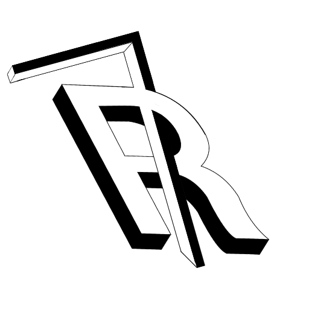

<p align="center">
  
</p>

<h1 align="center">Collectors Sphere</h1>

<p align="center">
  <strong>Die intelligente Multi-Sphere Sammlungsplattform für leidenschaftliche Sammler</strong>
</p>

<p align="center">
  <a href="#-spheres">Spheres</a> •
  <a href="#-features">Features</a> •
  <a href="#-installation">Installation</a> •
  <a href="#-tech-stack">Tech Stack</a> •
  <a href="#-roadmap">Roadmap</a>
</p>

<p align="center">
  
  
  
  
  
</p>

---

## 🌟 Was ist die Collectors Sphere?

Die Collectors Sphere ist eine moderne, datenschutzfreundliche Multi-Sphere Plattform zur Verwaltung deiner wertvollsten Sammlungen. Mit spezialisierten "Spheres" für verschiedene Sammelgebiete bietet Collectorssphere maßgeschneiderte Tools für TCG, Gaming, Dokumente, Geologie und mehr.

### Sphere-Konzept

Die Collectors Sphere organisiert sich in spezialisierte **Spheres** (Sphären), von denen jede optimiert ist für spezifische Sammelkategorien:

```
┌─────────────────────────────────────────────────────────────┐
│             Collectorssphere HUB (🏠)                       │
│           Universal Collection Manager                      │
└───────────┬─────────────────────────────────────────────────┘
            │
    ┌───────┴────────┬─────────┬──────────┬──────────┐
    │                │         │          │          │
┌───▼───┐  ┌────▼────┐  ┌────▼────┐  ┌──▼──┐  ┌───▼────┐
│  TCG  │  │ Gaming  │  │Official │  │ Geo │  │  Shop  │
│  🎴   │  │   🎮    │  │   📜    │  │ ⛏️  │  │  🛒    │
└───────┘  └─────────┘  └─────────┘  └─────┘  └────────┘
```

---

## 🎯 Spheres

### 🎴 CollectorsphereTCG
**Trading Card Game Platform**

Die ultimative Plattform für TCG-Sammler mit Unterstützung für:
- **Pokémon TCG** - Typ-Matchup Chart, Deck Builder, Meta Decks, Preis-Scanner
- **Yu-Gi-Oh!** - Combo Database, Banlist Checker, Deck Profiles
- **Magic: The Gathering** - Commander Deck Builder, Mana Curve, Format Checker

**Features:**
- ✅ Card Scanner mit AI-Erkennung (Kamera, Upload, Barcode)
- ✅ Live-Preisabfragen von pokemontcg.io, YGOPRODeck, Scryfall
- ✅ Deck Builder für alle Games
- ✅ Grading-System Integration (PSA, BGS)
- ✅ Collection Value Tracking
- ✅ Hot Cards Detection (High Value/Grade Cards)

### 🎮 CollectorssphereGAMING
**Video Game Collection Manager**

Multi-Platform Gaming Hub für:
- **PlayStation** (PS1-PS5, PSP/Vita) - Trophy Tracking, Digital Library Sync
- **Xbox** (OG-Series X/S) - Achievement Tracking, Game Pass Integration
- **Nintendo** (NES-Switch) - Complete Collection Tracker, eShop Prices
- **PC Gaming** (Steam, Epic, GOG) - Multi-Platform Sync, Playtime Stats
- **Retro Gaming** - Cartridge Grading, Sealed Game Tracker

**Features:**
- ✅ Game Scanner (Barcode & Cover Recognition)
- ✅ Price Tracking über alle Plattformen
- ✅ Wishlist Manager mit Price Alerts
- ✅ Platform-spezifische Stats
- ⏳ Trophy/Achievement Sync (geplant)

### 📜 CollectorssphereOFFICIAL
**Documents & Certificates Manager**

Professionelle Verwaltung für:
- **Urkunden & Zertifikate** - Bildungsabschlüsse, Zertifizierungen
- **Verträge** - Arbeitsverträge, Mietverträge, Versicherungen
- **Ausweise & Pässe** - Sicheres Dokumenten-Management
- **Steuer & Finanzen** - Steuerbescheide, Kontoauszüge
- **Medizinische Dokumente** - Impfausweise, Arztbriefe

**Features:**
- ✅ OCR Text-Erkennung für Dokumenten-Suche
- ✅ Secure Vault mit Verschlüsselung
- ✅ Ablaufdatum-Erinnerungen
- ✅ PDF-Generierung & Export
- ✅ Notarielle Beglaubigung Tracking

### ⛏️ CollectorssphereGEO
**Geology & Archaeology Platform**

Spezialisiert auf:
- **Mineralien** - Mohshärte-DB, Fundort-Tracking, Chemische Formel
- **Fossilien** - Zeitalter-Bestimmung, Arten-Identifikation, Echtheitsprüfung
- **Kristalle** - Kristallsystem, Reinheitsgrad, Heilstein-Eigenschaften
- **Meteoriten** - Klassifikation, Fundgeschichte, Nickel-Gehalt
- **Artefakte** - Datierung, Kulturzuordnung, Provenienz

**Features:**
- ✅ Specimen Scanner mit Foto-Erkennung
- ✅ GPS-basiertes Fundort-Tracking mit Karten
- ✅ Labor-Daten & Zertifikate-Management
- ✅ Wissenschaftliche Klassifikation
- ⏳ AI-gestützte Mineralien-Identifikation (geplant)

### 🛒 CollectorssphereSHOP
**Marketplace & Sales Platform**

Komplette E-Commerce Lösung:
- **Inventory Management** - Lagerbestand, SKU, Varianten
- **Pricing & Costing** - Einkaufs-/Verkaufspreise, Marge-Kalkulation
- **Seller Tools** - eBay/Etsy Integration, Bulk-Upload
- **Sales Analytics** - Umsatz, Bestseller, ROI-Tracking
- **Shipping Management** - Versandkosten, Tracking-Nummern

**Features:**
- ✅ Multi-Channel Listing (eBay, Etsy, Vinted)
- ✅ Automated Pricing (Market-basiert)
- ✅ Profit Calculator
- ✅ Customer Management
- ⏳ Inventory Sync (geplant)

---

## ✨ Core Features

### Universal Platform Features

| Feature | Beschreibung |
|---------|-------------|
| **Multi-Sphere Architecture** | Spezialisierte Tools für jede Sammelkategorie |
| **Cross-Platform** | Web, Desktop, Mobile - automatische Synchronisation |
| **Universal Search** | Sphere-übergreifende Suche |
| **Flexible Attributes** | 8+ Attributtypen: Text, Nummer, Tags, Checkbox, Datum, Link, Währung |
| **Barcode Scanner** | Unterstützt EAN-13, EAN-8, UPC-A, UPC-E, Code-128, QR |

### Dashboard & Analytics

```
+─────────────────────────────────────────────────────────+
│  Collectorssphere Dashboard                            │
├─────────────┬─────────────┬─────────────┬───────────────┤
│ 5 Spheres   │ 847 Items   │ €25,430     │ 18 Categories │
│ Active      │ Total       │ Total Value │ Across All    │
├─────────────────────────────────────────────────────────┤
│                                                         │
│  [Sphere Distribution]    [Value by Category]          │
│                                                         │
│  [Top Items]              [Recent Activity]            │
│   1. Charizard VMAX        - Card added to TCG         │
│   2. PS5 Sealed            - Game added to Gaming      │
│   3. Amethyst Geode        - Mineral added to Geo      │
+─────────────────────────────────────────────────────────+
```

### Import & Export

| Format | Import | Export | Bemerkung |
|--------|:------:|:------:|-----------|
| CSV    |   ✅   |   ✅   | Alle Spheres |
| JSON   |   ✅   |   ✅   | Mit Metadaten |
| PDF    |   ❌   |   ✅   | Export-Listen |
| Excel  |   ⏳   |   ⏳   | Geplant |

---

## 🛠️ Tech Stack

| Kategorie | Technologie | Version |
|-----------|-------------|---------|
| **Framework** | Next.js | 15 (App Router) |
| **Sprache** | TypeScript | 5.0+ (strict) |
| **Styling** | Tailwind CSS | 4.0 |
| **Backend** | Supabase | PostgreSQL 15 |
| **Auth** | Supabase Auth | SSR + JWT |
| **PWA** | next-pwa | 5.6 |
| **React** | React | 19 |
| **Hosting** | Vercel | Edge Runtime |

### Architektur

```
┌────────────────────────────────────────────────────────┐
│                    Frontend Layer                      │
│  ┌──────────┐  ┌──────────┐  ┌──────────┐            │
│  │ Next.js  │  │  React   │  │Tailwind  │            │
│  │   15     │  │    19    │  │  CSS 4   │            │
│  └────┬─────┘  └────┬─────┘  └──────────┘            │
│       │             │                                  │
│       └─────────────┼──────────────┐                  │
│                     │              │                  │
│  ┌──────────────────▼──────────────▼────────────┐    │
│  │         Sphere-Specific Components            │    │
│  │  TCG • Gaming • Official • Geo • Shop        │    │
│  └───────────────────┬───────────────────────────┘    │
└──────────────────────┼────────────────────────────────┘
                       │
┌──────────────────────▼────────────────────────────────┐
│                  API Layer                            │
│  ┌─────────────────────────────────────────────┐     │
│  │         Supabase Client (SSR)               │     │
│  │    Auth • Database • Storage • Realtime     │     │
│  └──────────────────┬──────────────────────────┘     │
└────────────────────┼──────────────────────────────────┘
                     │
┌────────────────────▼──────────────────────────────────┐
│                 Backend Services                      │
│  ┌────────────────────────────────────────────┐      │
│  │              Supabase                      │      │
│  │  PostgreSQL • Auth • Storage • Functions   │      │
│  └────────────────────────────────────────────┘      │
│                                                       │
│  ┌────────────────────────────────────────────┐      │
│  │           External APIs                    │      │
│  │  PokémonTCG • YGOPRODeck • Scryfall        │      │
│  │  OpenLibrary • Discogs • CoinGecko         │      │
│  └────────────────────────────────────────────┘      │
└───────────────────────────────────────────────────────┘
```

---

## 🚀 Installation

### Voraussetzungen

- Node.js 18+
- npm, yarn oder pnpm
- Supabase Account

### 1. Repository klonen

```bash
git clone https://github.com/westside0106/CollectR.git
cd CollectR
```

### 2. Abhängigkeiten installieren

```bash
npm install
```

### 3. Umgebungsvariablen

Erstelle eine `.env.local` Datei:

```env
# Supabase (erforderlich)
NEXT_PUBLIC_SUPABASE_URL=https://your-project.supabase.co
NEXT_PUBLIC_SUPABASE_ANON_KEY=your-anon-key

# APIs (optional - für erweiterte Features)
NEXT_PUBLIC_CURRENCYLAYER_API_KEY=your-key
NEXT_PUBLIC_GNEWS_API_KEY=your-key
DISCOGS_TOKEN=your-token
```

### 4. Datenbank einrichten

Führe die SQL-Migrationen in deinem Supabase Dashboard aus:

1. Gehe zu SQL Editor in Supabase
2. Führe die Migrations aus `supabase/migrations/` aus

### 5. Entwicklungsserver starten

```bash
npm run dev
```

Öffne [http://localhost:3000](http://localhost:3000)

---

## 📁 Projektstruktur

```
CollectR/
├── src/
│   ├── app/                    # Next.js App Router
│   │   ├── (hub)/              # Main Hub
│   │   │   └── hub/page.tsx
│   │   ├── (tcg)/              # TCG Sphere
│   │   │   └── tcg/
│   │   │       ├── page.tsx
│   │   │       ├── scanner/
│   │   │       ├── prices/
│   │   │       ├── deck-builder/
│   │   │       ├── pokemon/
│   │   │       ├── yugioh/
│   │   │       └── magic/
│   │   ├── (gaming)/           # Gaming Sphere
│   │   │   └── gaming/
│   │   │       ├── page.tsx
│   │   │       ├── scanner/
│   │   │       ├── prices/
│   │   │       └── playstation/
│   │   ├── (official)/         # Official Sphere
│   │   │   └── official/page.tsx
│   │   ├── (geo)/              # Geo Sphere
│   │   │   └── geo/page.tsx
│   │   ├── (shop)/             # Shop Sphere
│   │   │   └── shop/page.tsx
│   │   ├── collections/        # Universal Collections
│   │   ├── api/                # API Routes
│   │   └── page.tsx            # Dashboard
│   │
│   ├── components/             # React Components
│   │   ├── layout/
│   │   ├── TCGCardScanner.tsx
│   │   ├── BarcodeScanner.tsx
│   │   ├── AddToCollectionModal.tsx
│   │   └── ...
│   │
│   ├── hooks/                  # Custom Hooks
│   │   ├── useTCGStats.ts
│   │   ├── useGamingStats.ts
│   │   └── useGeoStats.ts
│   │
│   ├── lib/
│   │   ├── supabase/           # Supabase Client
│   │   └── themes/
│   │       └── sphere-themes.ts # Sphere Theme System
│   │
│   └── types/                  # TypeScript Types
│
├── public/
│   ├── brand/                  # Brand Assets
│   │   ├── collectr-hero.png
│   │   └── collectr-r.png
│   └── icons/                  # PWA Icons
│
├── middleware.ts               # Auth Middleware
└── next.config.ts              # Next.js Config
```

---

## 🎨 Sphere Theme System

Jede Sphere hat ein eigenes, konsistentes Design-System:

```typescript
// sphere-themes.ts
export const SPHERE_THEMES = {
  tcg: {
    emoji: '🎴',
    name: 'CollectorsphereTCG',
    colors: {
      primary: '#dc2626',      // Red
      gradient: 'from-red-600 to-amber-500'
    }
  },
  gaming: {
    emoji: '🎮',
    name: 'CollectorssphereGAMING',
    colors: {
      primary: '#7c3aed',      // Violet
      gradient: 'from-violet-600 to-pink-600'
    }
  },
  // ... weitere Spheres
}
```

---

## 🗺️ Roadmap

### ✅ Phase 1: Core Platform (Erledigt)
- [x] Multi-Sphere Architecture
- [x] Hub Landing Page
- [x] TCG Sphere (Pokémon, Yu-Gi-Oh!, Magic)
- [x] Gaming Sphere (PlayStation, Xbox, Nintendo, PC, Retro)
- [x] Official Sphere
- [x] Geo Sphere
- [x] Shop Sphere

### ✅ Phase 2: TCG Features (Erledigt)
- [x] Card Scanner (Camera, Upload, Barcode)
- [x] Price Checker mit Live APIs
- [x] Deck Builder
- [x] Grading System
- [x] Collection Stats

### 🔄 Phase 3: Gaming Features (In Arbeit)
- [x] Game Scanner
- [x] Price Tracking
- [x] Wishlist Manager
- [ ] Trophy/Achievement Sync
- [ ] Digital Library Integration

### 📋 Phase 4: Geo Features (Geplant)
- [x] Basic Specimen Management
- [x] Category System (Minerals, Fossils, Crystals, etc.)
- [ ] GPS Location Tracking mit Maps
- [ ] Lab Data & Certificates
- [ ] AI Mineral Identification
- [ ] 3D Specimen Viewer

### 🛒 Phase 5: Shop Features (Geplant)
- [ ] eBay Integration
- [ ] Etsy Integration
- [ ] Inventory Sync
- [ ] Automated Listing
- [ ] Sales Analytics Dashboard

### 🚀 Phase 6: Advanced Features (Geplant)
- [ ] AI Image Recognition (alle Spheres)
- [ ] Blockchain Verification (High-Value Items)
- [ ] AR Viewer (3D Models)
- [ ] Community Features
- [ ] Public Collections & Sharing

---

## 🔧 Scripts

```bash
npm run dev      # Entwicklungsserver (localhost:3000)
npm run build    # Produktions-Build
npm run start    # Produktions-Server
npm run lint     # ESLint ausführen
npm run type-check # TypeScript Type-Checking
```

---

## 🤝 Mitwirken

Beiträge sind willkommen!

1. Fork das Repository
2. Erstelle einen Feature-Branch (`git checkout -b feature/amazing-feature`)
3. Committe deine Änderungen (`git commit -m 'Add amazing feature'`)
4. Push zum Branch (`git push origin feature/amazing-feature`)
5. Öffne einen Pull Request

---

## 📄 Lizenz

MIT License - siehe [LICENSE](LICENSE) für Details.

---

## 🙏 Danksagung

Besonderer Dank an:

- [Supabase](https://supabase.com) - Backend as a Service
- [PokémonTCG API](https://pokemontcg.io) - Pokémon Card Data
- [YGOPRODeck](https://ygoprodeck.com) - Yu-Gi-Oh! API
- [Scryfall](https://scryfall.com) - Magic: The Gathering API
- [Open Library](https://openlibrary.org) - Book Database
- [Discogs](https://discogs.com) - Music Database
- [Vercel](https://vercel.com) - Hosting Platform

---

<p align="center">
  <strong>Made with ❤️ for collectors worldwide</strong>
</p>

<p align="center">
  <a href="https://github.com/westside0106/CollectR">GitHub</a> •
  <a href="https://github.com/westside0106/CollectR/issues">Issues</a> •
  <a href="https://github.com/westside0106/CollectR/discussions">Discussions</a>
</p>
